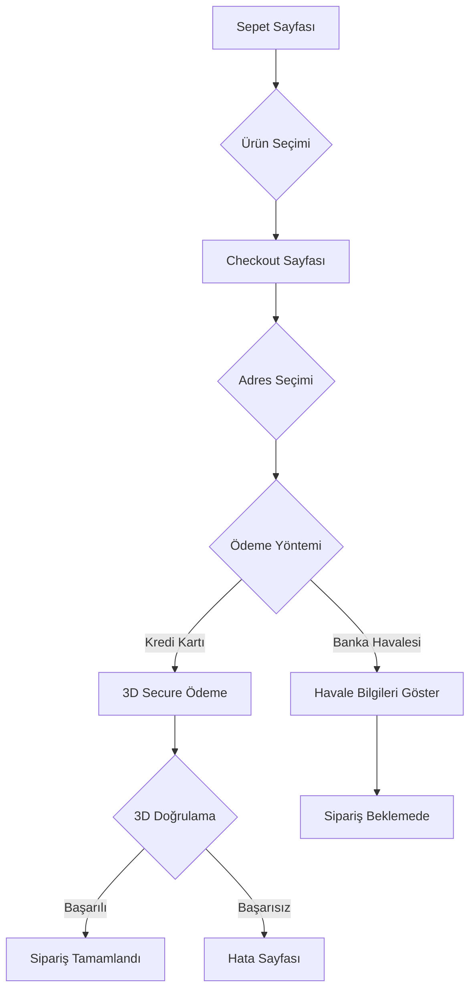

# Sipariş ve Ödeme Sistemi Dokümantasyonu

Bu dokümantasyon, CafeGastro projesindeki sipariş akışı, ödeme endpoint'leri ve kupon sistemini detaylı olarak açıklar.

---

## 📁 Dosya Yapısı

```
Frontend (Next.js)
├── app/
│   ├── sepet/page.tsx         # Sepet sayfası
│   ├── checkout/page.tsx      # Sipariş onay sayfası
│   ├── odeme/page.tsx         # 3D Secure ödeme formu
│   │   ├── basarili/page.tsx  # Ödeme başarılı
│   │   └── basarisiz/page.tsx # Ödeme başarısız
│   └── payment/
│       ├── success/page.tsx   # Callback başarı
│       └── fail/page.tsx      # Callback hata
│
├── lib/
│   └── api.ts                 # Tüm API fonksiyonları
│
└── components/
    └── cart-drawer.tsx        # Sepet drawer komponenti
```

---

## 🔄 Genel Sipariş Akışı



---

## 📦 Sepet API'leri

### Sepet Alma
```typescript
// GET /api/basket/
const basket = await basketGet()
```

**Response:**
```json
{
  "id": "cart-uuid",
  "items": [
    {
      "id": "item-uuid",
      "product_id": "product-uuid",
      "product_name": "Ürün Adı",
      "quantity": 2,
      "unit_price": "150.00",
      "product": {
        "name": "Ürün Adı",
        "price": "150.00",
        "is_in_stock": true
      }
    }
  ],
  "total_price": "300.00",
  "currency": "TRY",
  "discount_amount": 0,
  "coupon_code": null
}
```

### Sepete Ürün Ekleme
```typescript
// POST /api/basket/
await basketAdd(product_id, quantity, variant_id?)
```

**Request Body:**
```json
{
  "product_id": "product-uuid",
  "quantity": 1,
  "variant_id": null
}
```

### Sepet Miktarı Güncelleme
```typescript
// PATCH /api/basket/{item_id}/
await basketUpdateItem(item_id, quantity)
```

### Sepetten Ürün Silme
```typescript
// DELETE /api/basket/{item_id}/
await basketDeleteItem(item_id)
```

### Sepeti Temizleme
```typescript
// DELETE /api/basket/
await basketClear()
```

---

## 🎟️ Kupon Sistemi

### Kupon Uygulama
```typescript
// POST /api/cart/coupon/
const result = await couponApply("KUPON_KODU")
```

**Request Body:**
```json
{
  "coupon_code": "YUZDE10"
}
```

**Response (Başarılı):**
```json
{
  "success": true,
  "coupon_code": "YUZDE10",
  "discount_amount": 30.00,
  "discount_type": "percentage",
  "discount_value": 10,
  "final_amount": 270.00
}
```

### Kupon Kaldırma
```typescript
// DELETE /api/cart/coupon/
await couponRemove()
```

### Kupon Doğrulama (Uygulamadan)
```typescript
// POST /api/coupons/validate/
const result = await couponValidate(code, orderAmount, customerEmail?)
```

**Request Body:**
```json
{
  "code": "YUZDE10",
  "order_amount": 300.00,
  "customer_email": "kullanici@email.com"
}
```

---

## 🛒 Sipariş Oluşturma

### Sipariş API'si
```typescript
// POST /api/orders/
const result = await createOrder(payload)
```

### Request Payload
```typescript
interface CreateOrderPayload {
  cart_id: string;                  // Sepet ID'si
  currency: "TRY" | "USD" | "EUR";
  only_available_items: boolean;    // Stokta olmayanları otomatik ele
  payment_method: "credit_card" | "bank_transfer";
  
  // Müşteri Bilgileri
  customer_email: string;
  customer_phone: string;
  customer_first_name: string;
  customer_last_name: string;
  
  // Adres Seçenekleri (ID veya obje)
  shipping_address_id?: string;     // Kayıtlı adres kullanılacaksa
  shipping_address?: {              // Manuel adres girilecekse
    first_name: string;
    last_name: string;
    phone: string;
    address_line_1: string;
    address_line_2?: string;
    city: string;
    state?: string;
    postal_code?: string;
    country: string;
  };
  
  billing_address_id?: string;
  billing_address?: {
    type: "individual" | "corporate";
    first_name: string;
    last_name: string;
    phone: string;
    address: string;
    city: string;
    postal_code?: string;
    country: string;
    // Kurumsal fatura için
    company_name?: string;
    tax_office?: string;
    tax_number?: string;
  };
  
  // İsteğe bağlı ürün listesi
  items?: {
    product_id: string;
    quantity: number;
    variant_id?: string;
  }[];
}
```

### Response
```json
{
  "success": true,
  "order": {
    "id": "order-uuid",
    "order_number": "ORD-20240203-001",
    "status": "pending",
    "payment_status": "pending",
    "total": "270.00",
    "currency": "TRY"
  }
}
```

---

## 💳 Ödeme API'leri

### Ödeme Başlatma
```typescript
// POST /api/payments/create/
const result = await createPayment(payload)
```

### Kredi Kartı Ödemesi (3D Secure)
```typescript
const payload = {
  order_id: "order-uuid",
  provider: "kuwait",  // veya başka provider
  customer_info: {
    email: "kullanici@email.com",
    name: "İsim Soyisim",
    phone: "5551234567",
    card_number: "4155650100416111",    // Kart bilgileri
    card_expiry_month: "06",
    card_expiry_year: "25",
    card_cvv: "123",
    billing: {
      line1: "Adres satırı",
      line2: "",
      city: "Istanbul",
      state: "Istanbul",
      postcode: "34000",
      country_code: "792"
    },
    ip_address: ""
  }
}
```

**Response (Başarılı):**
```json
{
  "success": true,
  "payment_html": "<html>...3D Secure form...</html>"
}
```

**Kullanım:**
```typescript
if (res.success && res.payment_html) {
  // Banka 3D sayfasına yönlendir
  document.open();
  document.write(res.payment_html);
  document.close();
}
```

### Banka Havalesi Ödemesi
```typescript
const payload = {
  order_id: "order-uuid",
  provider: "bank_transfer",
  customer_info: {
    email: "kullanici@email.com",
    phone: "5551234567",
    first_name: "İsim",
    last_name: "Soyisim"
  }
}
```

**Response:**
```json
{
  "success": true,
  "payment_html": "<div>Banka hesap bilgileri...</div>",
  "offline_message": "Siparişiniz alındı. Lütfen ödemeyi belirtilen hesaba yapınız."
}
```

### Ödeme Ücreti Hesaplama
```typescript
// POST /api/payments/calculate/
const fees = await calculatePaymentFees(amount, method, currency)
```

**Request:**
```json
{
  "amount": 300.00,
  "payment_method": "bank_transfer",
  "currency": "TRY"
}
```

**Response:**
```json
{
  "success": true,
  "original_amount": 300.00,
  "discount_percentage": 5,
  "discount_amount": 15.00,
  "final_amount": 285.00,
  "message": "Havale ile %5 indirim"
}
```

### Ödeme Durumu Kontrolü
```typescript
// GET /api/payments/callback-handler?order=ORD-123
const status = await checkPaymentStatus(orderNumber)
```

**Response:**
```json
{
  "success": true,
  "payment_status": "paid",
  "order_status": "processing"
}
```

---

## 📋 Sipariş Durumları

### Sipariş Status
| Status | Açıklama |
|--------|----------|
| `pending` | Beklemede |
| `processing` | İşleniyor |
| `shipped` | Kargoya verildi |
| `delivered` | Teslim edildi |
| `cancelled` | İptal edildi |

### Ödeme Status
| Payment Status | Açıklama |
|----------------|----------|
| `pending` | Ödeme bekleniyor |
| `paid` | Ödendi |
| `failed` | Ödeme başarısız |
| `refunded` | İade edildi |

---

## 🔗 Kullanıcı Siparişleri

### Siparişlerimi Listele
```typescript
// GET /api/orders/my/
const orders = await getMyOrders(page, filters?)
```

**Filters:**
```typescript
interface OrderFilters {
  status?: string;
  payment_status?: string;
  search?: string;
}
```

### Sipariş Detayı
```typescript
// GET /api/orders/{order_number}/
const order = await getOrderByNumber(orderNumber)
```

### Sipariş Takibi (Misafir)
```typescript
// GET /api/orders/track/
const result = await trackOrder(orderNumber, email)
```

---

## 🏠 Adres API'leri

### Adresleri Listele
```typescript
// GET /api/addresses/
const addresses = await getAddresses()
```

### Yeni Adres Ekle
```typescript
// POST /api/addresses/
const result = await createAddress({
  first_name: "İsim",
  last_name: "Soyisim",
  phone: "5551234567",
  address_line_1: "Mahalle, Sokak No:1",
  address_line_2: "Kat:2 Daire:5",
  city: "Istanbul",
  state: "Kadıköy",
  postal_code: "34710",
  country: "Turkey",
  is_default: true,
  address_type: "shipping" // veya "billing"
})
```

### Adres Güncelle
```typescript
// PATCH /api/addresses/{id}/
await updateAddress(id, data)
```

### Adres Sil
```typescript
// DELETE /api/addresses/{id}/
await deleteAddress(id)
```

---

## 🔔 Frontend Event'leri

Sepet ve kupon değişikliklerini dinlemek için:

```typescript
// Sepet güncellendi
window.addEventListener('basket:updated', () => {
  // Sepeti yeniden yükle
})

// Kupon uygulandı
window.addEventListener('coupon:applied', () => {
  // UI güncelle
})

// Kupon kaldırıldı
window.addEventListener('coupon:removed', () => {
  // UI güncelle
})

// Auth gerekli (giriş yapmamış kullanıcı)
window.addEventListener('auth:required', () => {
  // Login modal/sayfa aç
})
```

---

## 💾 LocalStorage Kullanımı

### Misafir Sepeti
```typescript
// Giriş yapmamış kullanıcılar için
localStorage.getItem('guest_cart')
// Format: { items: [...], currency: "TRY" }
```

### Checkout Verileri
```typescript
// Ödeme sayfasına aktarım için
localStorage.getItem('checkoutCart')      // Sepet ürünleri
localStorage.getItem('checkoutDeliveryInfo')  // Teslimat bilgileri
```

### Session Storage
```typescript
// Checkout seçili ürünler
sessionStorage.getItem('checkout_selected_items')  // JSON array of IDs
sessionStorage.getItem('checkout_cart_id')
```

---

## 📊 Fiyat Hesaplamaları

### KDV Hesabı
```typescript
// API'den gelen fiyat KDV HARİÇ
const basePrice = parseFloat(product.price)
const priceWithVat = basePrice * 1.20  // %20 KDV eklenir

// Kuruş cinsinden (API için)
const priceKurus = Math.round(priceWithVat * 100)
```

### Para Birimi Formatı
```typescript
const formatPrice = (price: number) => {
  return price.toLocaleString("tr-TR", {
    style: "currency",
    currency: "TRY"
  })
}
// Örnek: "₺1.234,56"
```

---

## ⚠️ Önemli Notlar

1. **Stok Kontrolü:** `only_available_items: true` ile backend stokta olmayan ürünleri otomatik filtreler
2. **Kart Bilgileri:** Asla loglamayın veya veritabanına kaydetmeyin
3. **Amount:** Bazı endpoint'ler kuruş, bazıları TL olarak bekler - dikkat edin
4. **Currency:** Varsayılan `TRY`, desteklenen: `TRY`, `USD`, `EUR`
5. **Token:** Authenticated endpoint'ler için `Authorization: Bearer {token}` header'ı gerekli
6. **Tenant:** Multi-tenant yapıda `X-Tenant-Slug` header'ı gerekli

---

## 🔧 Headers Yapısı

```typescript
const headers = {
  'Content-Type': 'application/json',
  'Authorization': `Bearer ${token}`,
  'X-Tenant-Slug': 'tenant-slug',
  'X-Currency-Code': 'TRY'
}
```

---

## 📝 Örnek Tam Akış

```typescript
// 1. Sepete ürün ekle
await basketAdd(productId, 1)

// 2. Kupon uygula (opsiyonel)
await couponApply('INDIRIM10')

// 3. Sepeti al ve kontrol et
const basket = await basketGet()

// 4. Sipariş oluştur
const orderResult = await createOrder({
  cart_id: basket.id,
  currency: 'TRY',
  payment_method: 'credit_card',
  customer_email: user.email,
  shipping_address_id: addressId
})

// 5. Ödeme başlat
const paymentResult = await createPayment({
  order_id: orderResult.order.id,
  provider: 'kuwait',
  customer_info: { ... }
})

// 6. 3D Secure'a yönlendir
if (paymentResult.success && paymentResult.payment_html) {
  document.write(paymentResult.payment_html)
}

// 7. Callback sonrası durum kontrolü
const status = await checkPaymentStatus(orderNumber)
```
